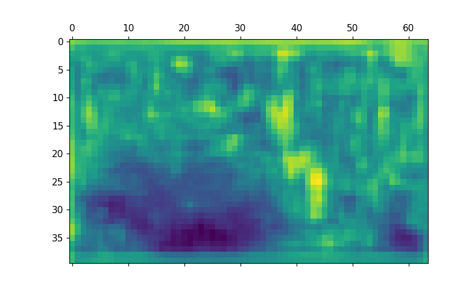
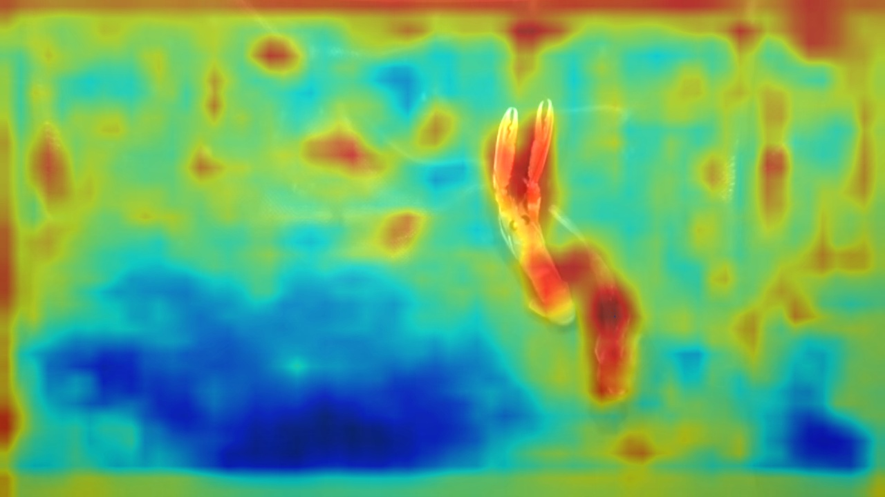
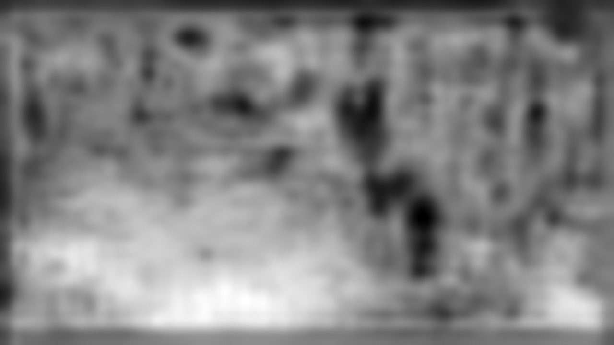
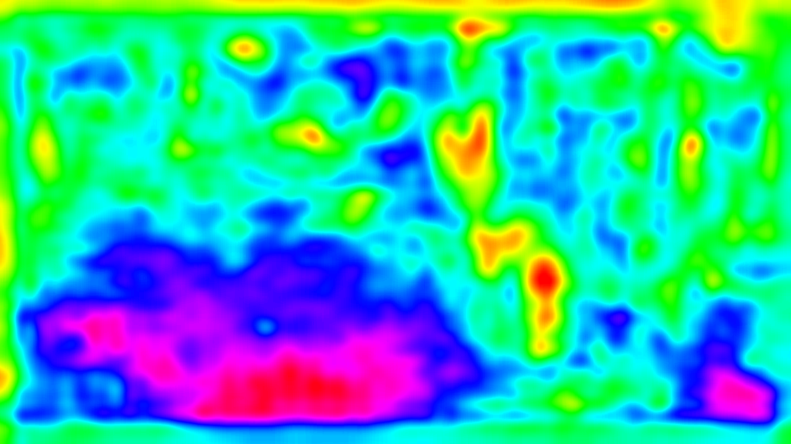
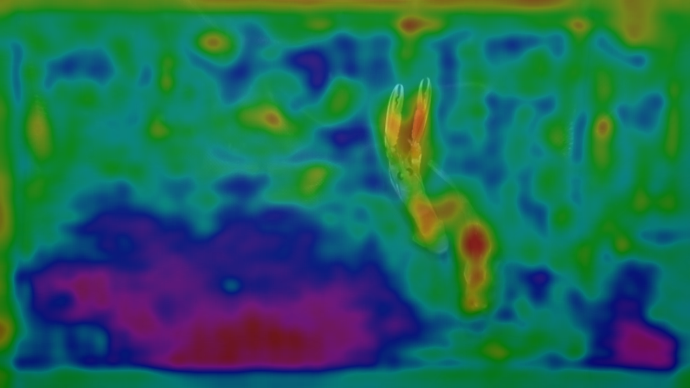
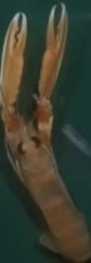
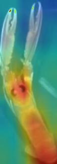

# gradCAM-YOLOv3-pytorch
This repository contains key scripts for implementing gradient CAM algorithm for YOLO v3 model. You don't need to look for other resources after learning from this implementation because they are inspired by previous superior works. The codes has been tested on pytorch 1.7.1. Note that the implementation is based on YOLO ultralytics version v3 [here you can find the model](https://github.com/ultralytics/yolov3)

## Environmeents
Pytorch 1.7.1
OpenCV 4.5.1

## How to use
1. Train/Download a model following the introduction
2. Read codes to learn more details, modify the configuration files and corresponding paths
3. model.py contains the model information and teach you how to register a hook function to fetch the gradients of non-leaf nodes. grad_CAM.py is used to generate CAM figures and I integrated 3 different methods in the codes and you can select any one from them and commented other two methods. 
  - color map based on PIL Image library
  - pixel matplot and color map based on openCV
  - the color map of object which has the highest score  
4. misc_functions contains some useful image processing functions
5. Run predict_test.py file to generate figures

## Results
Note that you can adjust the target convolutional layer from YOLO v3's three output scales freely in the script: model.py. 

## References
1. https://github.com/yizt/Grad-CAM.pytorch
2. https://medium.com/@stepanulyanin/implementing-grad-cam-in-pytorch-ea0937c31e82
3. https://github.com/pifalken/YOLOv3-GradCAM

The most important idea here is to understand the hook function and obtain the gradients of target layers. If you figure it out, you can transfer this algorithm on many models no matter classification CNN networks or complex object detection networks.

If you have any questions, welcome to contact me:)

